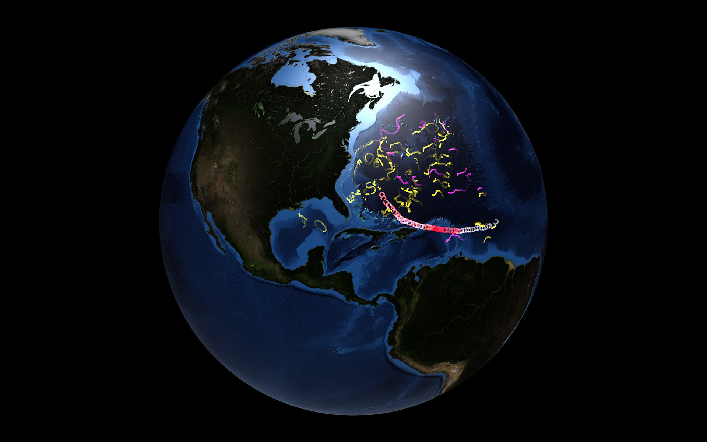

# DeepBlue for AMNH #HackTheDeep

This project is team [DeepBlue](https://github.com/bluecadet)'s contribution to the [AMNH HackTheDeep](https://github.com/amnh/HackTheDeep/) hackathon on Feb 10/11, 2018.

The main challenged we tackled is [The Eye of Maria](https://github.com/amnh/HackTheDeep/wiki/The-Eye-of-Maria). Our primary goal was to build the foundation for an app that could read and render the geo data provided in real time and provide an interactive interface to explore connections and facilitate research by eliminating the need to export visualizations offline. The secondary goal was to provide an accessible experience that's more approachable than some of the scientific tools currently used for the job.

In addition to the main challenge, the [Prototypes](Prototypes/) folder is a WIP snapshot of early prototypes for both [The Eye of Maria](https://github.com/amnh/HackTheDeep/wiki/The-Eye-of-Maria) and [Iron out the Kinks](https://github.com/amnh/HackTheDeep/wiki/Iron-Out-the-Kinks).

## Resources:

- [Final Demo Day Presentation](https://docs.google.com/presentation/d/1cXQmsw2hc7fWxYTbLMAVyDIg0_QEhp9qamNKOXF6oEA/edit?usp=sharing)
- [Screen recording on YouTube](https://youtu.be/0n6vodXpv6w)

[](https://youtu.be/0n6vodXpv6w)

## Team

- [Adiel Fernandez](https://github.com/adielfernandez)
- [Ben Bojko](https://github.com/adielfernandez)
- [Devon Burgoyne](https://github.com/DevonBurgoyne)
- [Kevin Zakzsevski](https://github.com/kevinzak)

## Tech

The project is primarily built with [Cinder](https://github.com/cinder/Cinder/), written in C++/OpenGL and built on Windows using Visual Studio.

## Setup

### 1. Clone the repo and all submodules (make sure you have an [SSH key](https://github.com/settings/keys) set up).

```bash
# clone this repo recursively
git clone git@github.com:HackTheDeep/eye-of-maria-DeepBlue.git --recursive --depth=1
git submodule update --init --recursive
```

### 2. Build Cinder

- Open the Cinder solution at [Cinder/proj/vc2015/cinder.sln](Cinder/proj/vc2015/cinder.sln)
- In the top menu bar, select Build > Batch Build
- Check Debug for x64 and Release for x64
- Press Build

### 3. Build and Run the Project

- Open the project solution at [Challenges/TheEyeOfMaria/OceanViz/vc2015/OceanViz.sln](Challenges/TheEyeOfMaria/OceanViz/vc2015/OceanViz.sln)
- Select *Release* from the target dropdown at the top and click the green play button to build and run the app (or press `F5`)

## Parsing new Data

Before you parse an .NC file, you can download the Net CDF4 binaries from [https://www.unidata.ucar.edu/downloads/netcdf/index.jsp](https://www.unidata.ucar.edu/downloads/netcdf/index.jsp). In the bin folder you'll find `ncdump.exe`, which you can use to investigate the headers of your .NC file by typing: `ncdump -h <data.nc>`.

1. Install NET CDF4 python package to parse .NC files:
  ```bash
  pip install netCDF4 # to parse nc files
  pip install jd2gcal # to parse julian dates
  ```
2. Convert NC file to JSON
  ```bash
  cd Challenges/TheEyeOfMaria/OceanViz/assets/data
  python nc_to_json.py Drifters1800.nc Drifters1800.json --fields time lat lon
  ```
  Type `python nc_to_json.py -h` to get a list of all options. Below is a full example
  ```bash
  python nc_to_json.py Drifters1800.nc Drifters1800.json --fields time lat lon --subinterval 8 --clamp 16
  ```
### Example Parse Configs

```bash
python nc_to_json.py Drifters1800.nc Drifters1800.json --fields time lat lon --subinterval 8 --clamp 32
python nc_to_json.py Anticyclonic.nc Anticyclonic.json --fields j1 lat lon --interval 8 # in reality '1' is a better interval for this dataset
python nc_to_json.py Cyclonic.nc Cyclonic.json --fields j1 lat lon
```


## Challenge Report

### Approach
We appraached the challenge of [The Eye of Maria](https://github.com/amnh/HackTheDeep/wiki/The-Eye-of-Maria) by attempting to map parallel drifter, float, and hurricane with the added element of user interaction. Instead of just mapping and playing a simple animation of data, we gave users control of the application to scrub along time and view key points through the timeline to better analyze and understand the data. We also implemented different settings to allow the user to control how the data is beign visualized in relation to each other. For instance, the hurricane can be mapped with colors denoting wind speed, storm category, pressure, etc.

### Technologies
We used an open source C++ library called Cinder to build our application and Adobe Photoshop to export the necessary assets.

### What Worked
We were able to successfully take real drifter, float, and hurricane data and map it on an interactive 3D model of the earth and show the relationship between the different data points. The data was also able to be displayed/colored in meaningful ways to visualize other properties of the driferts, floats, and hurricanes other than just latitude and longitude. We were also able to take the many different formats the data came in, parse it, and create a usable structure for our application.

### What Did Not Work
Due to time contraints, we were unable to fully flesh out out user interface and provide the fuls user functionality we had hoped for. Another pain point was the data, particularly the float data. Thanks to Brandon Liu we were able to have float data in JSON format that we were able to input and parse in our application. Otherwise, we most likely would not have been able to visualize and map the floats.

### Steps For the Future
#### Scalability/Modularity
Due to the time constraints, this system is not very flexible or scalable when it comes to different sets of data. It was built specifically for the kind we recieved initially for this challenge. One interesting step that could be taken in the future is to accept all forms of data (data format, types of data, varrying properties, etc) and seamlessly integrate it into the application. The dream would be the ability to drag and drop any kind of data that has lat/long properties over time and display them over time.

#### User Interaction
While the data visualization was our base goal, we would love to flesh out the user interaction in the future. The ability to pause the timeline and click and investigate individual data points on the map would make the tool more useful. We also want to give the user more control over what data visualizations are displayed/hidden as they use the tool. The ability to toggle between data properties, filtering entire data sets, and other data minipulation would enhance the tool greatly.

#### Prediction and Simulation
It would be great to take the data processing we're doing and attempt to predict future movement. Having our application learn from the data we are mapping and be able to create dynamic drifter and float data based off simulated hurricanes would be a huge undertaking, but a very rewarding tool.  
